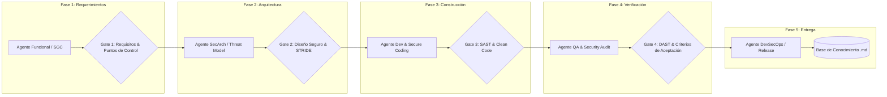

# 🏗️ Arquitectura Basada en Agentes para el Ciclo SSDLC End-to-End

Este documento define la orquestación de agentes especializados a lo largo del **Ciclo de Vida de Desarrollo de Software Seguro (SSDLC)** para la plataforma de evolución ISO 9001.

---

## 🔄 Flujo End-to-End del SSDLC y Puntos de Enlace de Agentes

---

## 🤖 Definición de Agentes por Fase

### 1. 🕵️ Agente Funcional & Gobernanza SGC
- **Misión:** Traducir las necesidades de la norma ISO 9001 en historias de usuario, requerimientos funcionales y criterios "a prueba de fallos".
- **Artefactos generados/actualizados:** `knowledge_base/functional/*.md`.
- **Punto de Control (Checkpoint):** Asignación de ID `CHK-XXX`, matriz de trazabilidad y resumen funcional.

### 2. 🛡️ Agente de Arquitectura de Seguridad (SecArch)
- **Misión:** Diseñar los límites del sistema, esquemas de datos seguros y mitigación de amenazas (OWASP Top 10, ASVS, STRIDE).
- **Artefactos generados/actualizados:** `knowledge_base/architecture/*.md` y `knowledge_base/security_ssdlc/*.md`.

### 3. 💻 Agente de Desarrollo Seguro (Secure Dev)
- **Misión:** Implementar componentes, lógica de negocio y UI siguiendo principios de codificación defensiva (validación de entradas, sanitización, principio de menor privilegio).

### 4. 🔍 Agente de Calidad y Auditoría de Seguridad (QA/Audit)
- **Misión:** Ejecutar pruebas de regresión, verificar el comportamiento del Diff Engine y validar que no existan vulnerabilidades antes del pase a producción.

### 5. 🚀 Agente DevSecOps & Knowledge Integrator
- **Misión:** Gestionar el empaquetado seguro, la entrega continua y garantizar que la base de conocimiento se sincronice con cada cambio exitoso.
