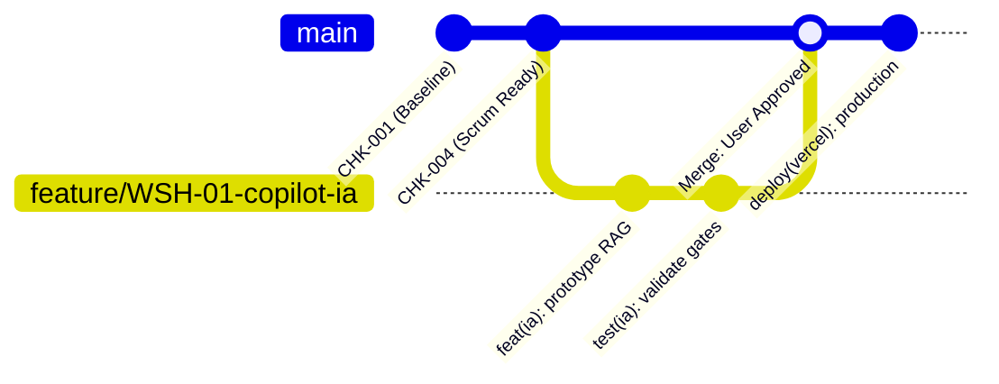

# 🌿 Estrategia de Versionamiento y Flujo de Ramas Git (GitFlow & Feature Branching)

Este documento define la política oficial de ramificación y control de versiones del proyecto para garantizar la estabilidad de `main` y la trazabilidad SSDLC.

---

## 🗺️ Modelo de Ramas (Branching Model)



---

## 📌 Convención de Nombres de Ramas

| Tipo de Rama | Formato de Nombre | Ejemplo | Propósito |
| :--- | :--- | :--- | :--- |
| **Producción** | `main` | `main` | Código estable, verificado y desplegado en producción en Vercel. |
| **Funcionalidad (Feature)** | `feature/<ID>-<descripcion>` | `feature/WSH-01-copilot-ia` | Desarrollo de nuevos requerimientos, épicas o historias del backlog. |
| **Corrección (Fix)** | `fix/<ID>-<descripcion>` | `fix/CHK-002-mobile-overflow` | Corrección de defectos, bugs de UI o accesibilidad. |
| **Seguridad / Refactor** | `sec/<ID>-<descripcion>` | `sec/GATE-03-sanitize-inputs` | Mejoras de seguridad, dependencias o refactorización técnica. |

---

## 🔄 Protocolo Operativo por Cada Solicitud de Cambio

1. **Creación de Rama:**
   - Ante cada nuevo requerimiento, el Agente creará y se posicionará en una nueva rama:
     ```bash
     git checkout main
     git pull origin main
     git checkout -b feature/<ID>-<nombre-descriptivo>
     ```
2. **Desarrollo y Verificación Local:**
   - Implementación de código y pruebas (`ng build`).
   - Registro de documentación en la Base de Conocimiento (`.md`).
3. **Publicación de la Rama Feature:**
   - Se realiza commit y push a la rama feature remota:
     ```bash
     git push -u origin feature/<ID>-<nombre-descriptivo>
     ```
4. **Compuerta de Aprobación del Usuario:**
   - **EL AGENTE NUNCA HARÁ MERGE A `main` DE FORMA AUTÓNOMA.**
   - El agente informará que la funcionalidad está lista y verificada en su rama feature y esperará la confirmación explícita del usuario para integrar a `main`.
5. **Integración (Merge a `main`):**
   - Una vez autorizado por el usuario:
     ```bash
     git checkout main
     git merge feature/<ID>-<nombre-descriptivo>
     git push origin main
     ```
